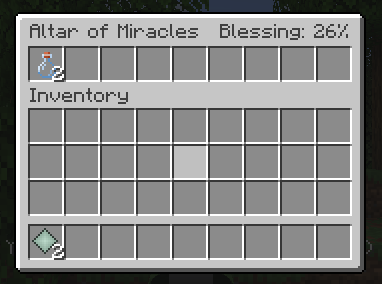
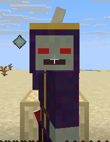
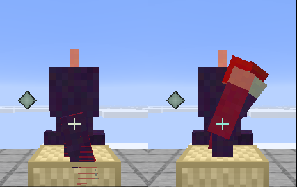

<p align="center"></p>

# MiracleLoader

> Forge hammers. Fabric stitches. Miracle just happens.

A mod loader for Minecraft Java Edition 26.x that works *by miracle*. Well, technically: since 26.1 the game ships unobfuscated, and half the pain that Gradle plugins, mappings and remapping existed to solve has simply evaporated. We take that and run with it, shamelessly.

- **No toolchain.** A mod is `javac`, `jar` and one `miracle.mod.toml`. No Gradle, no Loom, no five-minute project syncs.
- **No mixins.** Instead there's **RGCT**, the Runtime Game Class Transformer, built on the JDK's own ClassFile API. Zero dependencies. Actually zero.
- **No magic, in the bad sense.** Who patched what is printed at startup. Who crashed the game is written in the crash report.

For those who'd rather not write everything from scratch, there's **MiracleToolChain**: a command line that creates, builds and runs mods, and a library mod with events, merge-ready game values, commands, configs and resource loading. The library is an ordinary mod with no special privileges, so anything it can do, you can do too.

> **Status: 1.5.2, stable:** within 1.x, nothing a mod can use breaks (the promise, and what it covers, is in [the specification, section 12](docs/SPEC.md#12-versioning-and-stability); Event Horizon Extension is still experimental). Runs on real Minecraft 26.x (client and server) and, through baked variants, on obfuscated 1.21.11. RGCT hooks observe, change or cancel game methods, and when several mods hook the same method their effects merge by fixed rules instead of overwriting each other. MiracleToolChain's `miracle` command creates, builds and runs mods with no Gradle in sight, and its library covers the common cases without naming a single game method.

The full contract of the toolchain, the build and the library is in the [specification](docs/SPEC.md).

---

## Quick start: making a mod

```bash
git clone https://github.com/Hronosin/MiracleLoader && cd MiracleLoader
ln -s "$PWD/miracle" ~/.local/bin/miracle     # the MiracleToolChain command line

miracle genesis holy-hops                     # a new mod project. Let there be mod.
cd holy-hops
miracle pray client                           # compile, bake, and play it
miracle scriptorium                           # optional: open the folder in IntelliJ IDEA or VS Code
```

That's the whole setup. No Gradle, no IDE plugin, no launcher: `miracle` downloads Minecraft, its libraries and assets from Mojang (cached in `~/.cache/miracle`), compiles the mod, runs the game with MiracleLoader and your mod, and logs you in offline. Details in [MiracleToolChain](#miracletoolchain).

**On Windows** it's the same, minus bash. Install a JDK 25 (`winget install EclipseAdoptium.Temurin.25.JDK`), unzip `miracle-toolchain-<version>.zip` from the [releases](https://github.com/Hronosin/MiracleLoader/releases) somewhere, and add that folder to your `PATH` (or clone the repo: `miracle.cmd` builds it on first use). Then, in cmd or PowerShell:

```bat
miracle genesis holy-hops
cd holy-hops
miracle pray client
```

`miracle.cmd` finds Java through `JAVA_HOME` or the `PATH`, and says so if it's too old. No PowerShell scripts, so no execution policy to fight.

Two things Windows does to everyone the first time:

- **PowerShell doesn't run files from the current folder by name.** Until the folder is on your `PATH`, type `.\miracle.cmd` there, not `miracle.cmd` (cmd doesn't mind either way).
- **Files from a downloaded zip are marked "from the internet"**, and double-clicking them brings up SmartScreen. Unblock the zip before extracting it (right-click > Properties > Unblock), or afterwards run `Get-ChildItem -Recurse | Unblock-File` in the extracted folder. (Notepad asking whether to trust `SPEC.md` is the same mark.)

Keep projects out of OneDrive-synced folders (the Desktop often is one): OneDrive syncing a running game's world files gets in the way.

## Quick start: hacking on the loader

You need **JDK 25+** (Minecraft 26.x requires it anyway). On Fedora: `sudo dnf install java-25-openjdk-devel`; on Windows: `winget install EclipseAdoptium.Temurin.25.JDK`.

```bash
./build.sh   # build the loader, the fake game and the example mods
./run.sh     # run the fake game with the example mods
./test.sh    # smoke tests (including baking for a fake obfuscated game)
```

On Windows: `build.cmd` and `run.cmd` (`.\build.cmd` in PowerShell). The build itself is one Java program, [tools/build/Build.java](tools/build/Build.java), which both scripts run, so it's the same build everywhere and needs nothing but the JDK. The tests are still a bash script for Linux and macOS; on Windows, run them in WSL.

With several JDKs installed: `JAVA_HOME=/usr/lib/jvm/java-25-openjdk ./build.sh` (Windows: `set JAVA_HOME=C:\path\to\jdk-25` first).

The MiracleToolChain library and the real-game examples compile against Minecraft itself, so `build.sh` builds them only when it finds a 26.x client: from Prism Launcher, from the toolchain's own cache (anything `miracle pray` ever ran), or from `MC_JAR=... MC_LIBS=...`. It then fetches the dictionaries it bakes against by itself, for `1.21.11` and every `26.*` release (`MIRACLE_TARGETS` to choose others, `MIRACLE_OFFLINE=1` to use only what's cached).

## How it launches

Put the loader on the class path next to the game and use `MiracleMain` as the main class instead of the game's:

```bash
java -cp miracle-loader.jar:minecraft.jar:<libraries> \
     io.github.hronosin.miracle.MiracleMain <game arguments>
```

The launcher can leave everything else as it is. Mods are loaded from `./mods`.

**Any Java will do to start it.** MiracleLoader needs Java 25 (RGCT is built on the JDK's ClassFile API, so its bytecode can't be downgraded), but launchers start each Minecraft version with the Java that version asks for, 21 for 1.21.11. So there's a second door: `io.github.hronosin.miracle.Resurrection`, the one class compiled for Java 8. On Java 25 or newer it hands over to `MiracleMain` in the same process. On anything older it finds a Java 25 or newer on the machine and resurrects the game in it, with the same JVM options, class path and arguments; it stays behind as a thin shepherd, so the output passes straight through, closing the launcher's process closes the game, and the exit code is the game's own:

```
[Miracle] This game was started with Java 21 (Minecraft 1.21.11 asks for Java 21), and MiracleLoader needs Java 25 or newer.
[Miracle] Resurrecting the game in Java 25: /usr/lib/jvm/java-25-openjdk-amd64/bin/java
```

It looks in `-Dmiracle.java` or `MIRACLE_JAVA` (a Java home or a `java` binary) first, then `JAVA_HOME`, the `PATH`, and the usual places: system JVM folders, SDKMAN, IntelliJ's `~/.jdks`, Prism's and the official launcher's downloaded runtimes, Adoptium, Zulu and Microsoft on Windows, macOS's `JavaVirtualMachines`. If there's no Java 25 anywhere, it says so, lists what it found, and exits.

| Property | Default | Purpose |
|---|---|---|
| `-Dmiracle.target` | `net.minecraft.client.main.Main` | the game's main class (`net.minecraft.server.Main` for servers) |
| `-Dmiracle.modsDir` | `mods` | mods folder |
| `-Dmiracle.gameClasspath` | JVM class path minus the loader | if the game is not on the class path |
| `-Dmiracle.dump` | none | folder to write every patched class into, for debugging |
| `-Dmiracle.java` | none | `Resurrection`: the Java 25+ to relaunch in (a Java home or a `java` binary); also `MIRACLE_JAVA` |
| `-Dmiracle.javaSearch` | `auto` | `Resurrection`: `explicit` looks only at `miracle.java`/`MIRACLE_JAVA` and `JAVA_HOME` |
| `-Dmiracle.showCommand` | `false` | `Resurrection`: print the relaunch command |

### As a Java agent: any launcher, the official one included

The loader jar is also a Java agent. Leave the game's main class alone and add one JVM argument:

```
-javaagent:/path/to/miracle-loader.jar
```

Before the game's own `main` runs, the agent finds the mods, puts them on the class path and patches game classes as they load: the same mods, variants, layers, `miracle.lock` and crash reports as with `MiracleMain`. In the official Minecraft Launcher that's Installations > Edit > More options > JVM arguments; name the mods folder after an `=` if it isn't `mods` in the game folder: `-javaagent:C:\miracle\miracle-loader.jar=C:\Users\You\AppData\Roaming\.minecraft\mods`. The profile's Java has to be 25 or newer (26.x runs on 25 anyway); an agent can't relaunch the game in another Java the way `Resurrection` does, so on an older one it says which setting to change and stops. The whole test suite also runs this way: `AGENT=1 ./test.sh`. One of the two is enough: an instance set up for Prism (main class `Resurrection`) that also gets the `-javaagent` argument runs fine, the agent does the work and the main class just hands over.

### The last word

When the game ends the way it should (you quit, the server stops), the loader says goodbye: `Cool :D`, the last line before the launcher's own "exited with code 0". Not after a crash, and not when the process is killed. `-Dmiracle.cool=false` keeps it quiet.

### Prism Launcher

```bash
miracle consecrate --list                   # list instances
miracle consecrate "My Instance"            # install (close Prism first)
miracle consecrate --uninstall "My Instance"  # remove
```

`consecrate` (boring name: `install`) puts the loader into the instance's `libraries/`, adds a MiracleLoader custom component (it overrides `mainClass` with `Resurrection`, so the instance's Java doesn't have to be 25), and copies the MiracleToolChain library into `mods/`. The instance can be named by its folder or by the name Prism shows. Prism's data is found where it lives on Linux (Flatpak or not), macOS and Windows (`%APPDATA%\PrismLauncher`); for a portable Prism, `--prism "folder"` or `PRISM_DATA`. Use a clean vanilla instance: Fabric or NeoForge in the same instance would fight over `mainClass`.

In a checkout, `./prism-install.sh "My Instance"` (Windows: `prism-install.cmd`) builds first and copies the example mods as well.

Tip: Mojang's 26.x launch arguments include `--enable-native-access=ALL-UNNAMED` and `--sun-misc-unsafe-memory-access=allow`. Adding them to the instance's JVM arguments silences LWJGL's startup warnings.

## Writing a mod without a toolchain

`miracle.mod.toml`:

```toml
id = "hello-mod"
name = "Hello Mod"
version = "0.1.0"
entrypoint = "com.example.hello.HelloMod"
authors = ["Hronosin"]
```

The code:

```java
public final class HelloMod implements MiracleMod {
    @Override
    public void transform(Rgct rgct) {
        rgct.target("net.minecraft.world.entity.player.Player")
            .method("jumpFromGround")
            .atHead(self -> System.out.println("hop, bytecode patch"));
    }

    @Override
    public void onLaunch() {
        System.out.println("Miracles are real.");
    }
}
```

The entire build:

```bash
javac --release 25 -cp miracle-loader.jar:minecraft.jar -d classes HelloMod.java
cp miracle.mod.toml classes/
jar --create --file hello-mod.jar -C classes .
```

More examples live in `examples/`.

### Dependencies and libraries

```toml
depends = ["miracle-toolchain>=1.0.0", "some-other-mod", "miracle>=1.0.0"]
```

Every mod listed must be in `mods/`, at least that version if one is given, and loads before the mod that needs it. `miracle` means the loader itself. A missing or outdated dependency, or a circle of mods waiting for each other, stops the game before it starts, with every problem listed at once.

Since 1.1, a mod can also be **entangled** with mods it doesn't need: `entangles = ["create>=6.0"]`. If that mod is there (and new enough), it loads first, and `Mods.entangled("your-mod")` lists it; if it isn't, nothing happens. That's for optional compatibility: Event Horizon's `Wormhole` runs your code for another mod only when it's there, and `against = ["libs/create.jar"]` in `miracle.project.toml` lets you compile against its jar without shipping it.

A mod with `library = true` and no `entrypoint` just brings classes for other mods. A library that needs to patch things for the mods using it can register patches in their name: `rgct.onBehalfOf("their-mod")`, allowed only for mods that depend on it. `io.github.hronosin.miracle.api.Mods` tells any mod who else is loaded, which jar a class came from, and which game is running.

### A real gameplay mod: `examples/dirt-diamonds`

The classic: 1 dirt → 1 diamond. The recipe is a plain JSON file in `data/dirt_diamonds/recipe/` inside the mod jar. The mod hooks `VanillaPackResourcesBuilder#build` and adds its own jar as one more root of the built-in vanilla pack, so the game finds the recipe as if it were its own. No recipe objects in code.

The same builder also assembles the client's vanilla *resource* pack, so the hook reads its `PackLocationInfo` argument and only touches the data pack.

On a dedicated 26.2 server the recipe count at startup goes from 1585 to 1586, and stays there after `/reload`.

### `examples/super-jump` + `examples/sprint-jump`: two mods, one method

Both hook `LivingEntity#getJumpPower`. super-jump multiplies players' jump power by 1.5; sprint-jump adds 0.1 while sprinting. Neither overwrites the other: RGCT merges them into `(vanilla + 0.1) × 1.5`, in whatever order they load.

```java
// super-jump
.interceptReturn(ctx -> {
    if (ctx.self() instanceof Player) ctx.multiplyReturnValue(1.5f);
})
// sprint-jump
.interceptReturn(ctx -> {
    if (ctx.self() instanceof Player p && p.isSprinting()) ctx.addToReturnValue(0.1f);
})
```

Easy to check in game:

| installed | jump height |
|---|---|
| vanilla | 1.25 blocks |
| sprint-jump, sprinting | 1.84 |
| super-jump | 2.59 (over a 2-block wall, no fall damage) |
| both, sprinting | 3.79 (onto a 3-block wall; landing on flat ground costs half a heart) |

Only with both mods can you sprint-jump onto a 3-block wall.

### Compiling against Minecraft

The mods above compile directly against the Minecraft client. `build.sh` finds the newest 26.x client jar Prism has downloaded, and reads Prism's metadata for that version to put exactly its libraries on the class path (Minecraft's classes extend Brigadier, DataFixerUpper and friends, so javac needs them too). Jars left over from other instances, like an old Forge, stay out. Elsewhere: `MC_JAR=/path/to/client.jar MC_LIBS=/folder/with/that/versions/jars ./build.sh`.

## RGCT

```java
rgct.target("a.b.SomeClass")
    .method("name")                 // every overload
    .atHead(self -> ...)            // observe: before the first instruction
    .atReturn(self -> ...)          // observe: before every normal return
    .and()
    .method("name", "(IF)Z")        // one exact overload
    .interceptHead(ctx -> ...)      // read/change arguments, or cancel the method
    .interceptReturn(ctx -> ...)    // read/replace the return value
    .redirect(Foo::bar, Mine::bar)  // replace one call the method makes, for free
    .and()
    .raw(classTransform);           // raw ClassFile API: you're on your own
```

### Observing: `atHead` / `atReturn`

The hook gets `self`, the object the method was called on. It is `null` for static methods and at the head of a constructor, where `this` is not initialized yet. Observing is nearly free: one static call, no allocation.

### Intercepting: `interceptHead` / `interceptReturn`

The hook gets a `HookContext`. It can read the call, and ask for **effects**:

| | `interceptHead` | `interceptReturn` |
|---|---|---|
| read | `self()`, `arg(i)` | `self()`, `arg(i)`, `returnValue()` |
| set | `setArg(i, v)` | `setReturnValue(v)` |
| stack | `addToArg`, `multiplyArg`, `clampArg` | `addToReturnValue`, `multiplyReturnValue`, `clampReturnValue` |
| skip | `cancel()`, `cancel(value)` | |

```java
// (method names are illustrative)
.method("damage").interceptHead(ctx -> ctx.multiplyArg(0, 0.5))                 // half damage
.method("explode").interceptHead(ctx -> ctx.cancel())                           // no explosions
.method("getMaxHealth").interceptReturn(ctx -> ctx.addToReturnValue(20))        // +10 hearts
```

### Layers: many mods, one method

This is the part MiracleLoader exists for. Hooks don't change the game directly. **Every hook on a method sees the same snapshot**, the values as vanilla produced them, and only declares what it wants. Once all hooks have run, RGCT merges their effects by fixed rules and applies the result once:

1. **set** replaces the base value.
2. **addTo** amounts are summed onto it.
3. **multiply** factors are all multiplied in.
4. **clamp** ranges are intersected and applied last.
5. **cancel**: if any mod cancels, the method doesn't run.

So `result = clamp((base + Σ adds) × Π factors)`, and it never depends on which mod loaded first. Three mods that give ×2, ×1.5 and +0.1 to jump power always give `(v + 0.1) × 3`.

**Conflicts.** Adding and multiplying always stack. Setting is exclusive, so when several mods `set` the same value (or `cancel` with a value):

- if they set the same value, fine;
- otherwise the highest `priority` wins: `.method("motd").priority(10).interceptReturn(...)`;
- a tie with different values stops the game with an error naming every mod involved:

```
RgctConflictException: RGCT conflict at Player#motd()Ljava/lang/String;, return value (priority 0):
'clash-a' sets "A", 'clash-b' sets "B". Mods that set the same value must agree, or one of them
needs a higher priority
```

Crashing sounds harsh, but the alternative is one mod silently not working and nobody knowing why.

**Checked before the game starts.** RGCT reads each hook's bytecode at startup (following calls into helper methods of the same class) to see which effects it can produce. The startup report shows it next to every hook, and possible conflicts are flagged before a single block is rendered:

```
[Miracle]   net.minecraft.world.entity.LivingEntity
[Miracle]     getJumpPower()F   intercept@RETURN  <- sprint-jump  [modifies return]
[Miracle]     getJumpPower()F   intercept@RETURN  <- super-jump  [modifies return]
[Miracle/WARN] RGCT: mods 'clash-a', 'clash-b' may all set its return value (...#motd) at priority 0.
               Fine while they agree; if they ever don't, the game stops with a conflict error.
```

It's a warning, not an error, because hooks usually set things conditionally (only for players, only while sprinting...) and two mods may never actually disagree.

Details:

- Primitives travel boxed: an `int` argument is an `Integer`, a `float` return is a `Float`. Plain Java casts unbox them: `(float) ctx.returnValue()`.
- `set` needs exactly the right type, and a wrong one (a `Double` where the game wants a `float`) fails right away with an error that names the method, the expected type and your mod. The stacking effects take any `Number`; integral results are rounded to the nearest value.
- Interception boxes the arguments into an `Object[]` on every call; the JIT usually makes all of it disappear (see *What a hook costs* below). Where it can't (a hook that keeps the context, or effects too many to merge simply), a redirect is the cheaper tool.
- **Constructors** (since 1.6): `interceptHead` on `"<init>"` runs before `super(...)`. `self()` is null there (the object isn't made yet), the arguments can be changed, and `cancel()` throws: an object can't be left half made. `interceptReturn` on a constructor sees the finished object. Raw transforms are outside the layer system entirely.

### Direct calls

Every patched spot in a game method is an `invokedynamic` site. The first time it runs, RGCT binds it for good to the hook it calls: an observing hook's `run`, or, for a method with a single intercepting hook, that hook with no loop and no lookup around it. The JIT then sees the hook as a constant and inlines it into the game method, as if it had been written there; a hook that only reads leaves nothing behind but the check it makes. Methods with several hooks get a chain of them bound, each hook a constant of its own (since 1.6; before, a loop the JIT couldn't see through). Hooks that only look (most of them) skip the layer merging entirely.

**What a hook costs** (since 1.6). The context remembers the commonest effects without a list: one `set` or `cancel`, and additions and factors for one argument or the return value. Merging those is a few lines of arithmetic, so the JIT can inline the whole thing and the context, the arguments array and their boxes never exist. On a method called 20 million times in a loop (JDK 25, one core):

| hook | 1.5 | 1.6 |
|---|---|---|
| reads only (`interceptReturn`) | 1.2 ns, 0 B | 1.2 ns, 0 B |
| `multiplyReturnValue` | 35 ns, 176 B | 1.2 ns, 0 B |
| `addToArg` (4 arguments) | 84 ns, 360 B | 2.8 ns, 0 B |
| `setReturnValue` / `cancel(value)` | 185 ns, 1 KB | 1.2 ns, 0 B |
| two hooks on one method | 31-53 ns, 104-208 B | 1.2-2.8 ns, 0 B |

The bare method costs the same 1.2 ns. More than that (two `set`s, a `clamp`, effects on several arguments) goes the full way, with the same rules and the same results: priorities and conflicts are worked out only when there is something to work out.

| patched method (100 million calls, JDK 25) | 0.4 | 0.5 |
|---|---|---|
| observed (`atHead`) | 5.4 ns | 4.3 ns |
| one hook that reads (`interceptHead`, maybe cancels) | 103 ns | 3.7 ns |
| one hook that multiplies the return value | 100 ns | 34 ns |
| two hooks that multiply it | 145 ns | 57 ns |

`-Dmiracle.directCalls=false` patches the old way (a static call with an id per spot), for comparison or suspicion; the results are the same either way, and the test suite checks both.

### Transubstantiation: `redirect`

Sometimes the method is fine and one call inside it isn't. `redirect` replaces a call that a method makes, at the spot where it makes it, and nowhere else:

```java
rgct.target("net.minecraft.client.renderer.LevelRenderer")
    .method("extractSectionDrawGroups")
    .redirect(ChunkSectionLayer::values, Layers::cached);   // no array clone per section per frame
```

- **Both sides have the same shape**, so the compiler checks that the replacement takes and returns exactly what the call did. For an instance method the object comes first: `Player::getName` is replaced by something taking a `Player` and returning a `String`. `redirectVoid` is the same for calls that return nothing. Up to nine values, the object included. An overloaded method is picked by the replacement's types: `.redirectVoid(PrintStream::print, (PrintStream out, String s) -> ...)`.
- **Wider is fine.** The replacement may take wider types than the call passes, and may return `Object`, which is cast back where the game uses it. That's how a mod names game classes that moved or don't exist in every version it supports: as `Object`. If the call is overloaded too, say which one with a type witness: `.<PrintStream, String>redirectVoid(PrintStream::println, Mine::shout)`.
- **Free.** The call becomes an `invokedynamic` site bound once, for good, to the replacement itself: no context, no boxing, no array. A static method (or a lambda that captures nothing) is called with its own types, and the JIT inlines it as if the game had called it.
- **The call can be a lambda** that makes exactly one call (`p -> p.getName()`), for when `Foo::bar` would be ambiguous. `super` calls and private methods can't be redirected.
- **Inherited methods too** (since 1.5.2): javac writes `ServerLevel::getBlockRandomPos` down as `Level.getBlockRandomPos`, the class that declares it, while the game's call names `ServerLevel`. A call naming a subclass, a subinterface or an implementing class is the same method, and matches. (Before 1.5.2 it didn't, and was warned about as a call the method never makes.)
- **A `new` too** (since 1.5.0): `.redirect(Point::new, Points::of)` hands every `new Point(x, y)` in the method to a factory with the same arguments, which may return a shared or a recycled object, or a subclass. Constructor calls without a `new` (`super(...)`, `this(...)`) are never touched.
- **Safe in `transform()`**: naming `Player::getName` doesn't load `Player`. As a mod class loads, RGCT relinks its redirect lambdas so that they are written down by name and only looked up when the game first makes the call.
- **One mod per call.** Effects merge; replacements can't. Two mods redirecting the same call in the same method stop the game with an error naming both. Redirecting different calls in the same method, or hooking a method whose calls are redirected, is fine.
- A call the method never makes (a different game version, most likely) is warned about, like a missing method. Baking translates the names: a redirect of `Player::getName` becomes one of `o.a::c` on 1.21.11.

### General

- If a hook throws, the exception keeps its type, but gets a note attached saying which mod is to blame.
- If a target method doesn't exist, RGCT warns you. The mod was most likely built for another game version.

### The one rule

**Don't touch game classes inside `transform()`.** Patches are still being collected at that point, so the class would load unpatched. The loader catches this and refuses to start, naming the mod. An honest crash right away beats a patch that silently didn't apply half an hour into a session.

## OSHI: Old School Hook Integration

Two things for people who still remember `ClassNode`s and mapping files.

### Bring your own tools: `rawBytes`

```java
rgct.target("net.minecraft.world.entity.player.Player").rawBytes(bytes -> {
    ClassNode node = new ClassNode();          // your ASM, shaded into your mod
    new ClassReader(bytes).accept(node, 0);
    // ... the monstrous tree surgery of your dreams ...
    ClassWriter w = new ClassWriter(ClassWriter.COMPUTE_FRAMES);
    node.accept(w);
    return w.toByteArray();
});
```

The loader stays dependency-free: whatever library you use, you bring it. `rawBytes` runs after every other patch on the class, is outside the layer system, and the startup report and log say who did it. Your library must read Java 25 class files (ASM 9.8+). A Mixin bridge would be a mod of its own built on this.

### Reversed mapping: one source, many versions

Minecraft 1.21.11 and older ship with scrambled names: `LivingEntity` is `chl`, `getJumpPower()` is `fF`, and short names get reused across overloads (`a`, `a`, `a`...). Other loaders translate the whole game to stable names at every launch. MiracleLoader does the opposite: **the mod is translated once, at build time, for every version you target**, and the loader just picks the right variant. Nothing is remapped at runtime.

You write and compile against readable names (an unobfuscated 26.x jar). Then:

```bash
tools/fetch-dictionary.sh 1.21.11   # Mojang's client jar + official mappings, into ~/.cache/miracle
tools/fetch-dictionary.sh 26.1.2    # unobfuscated versions: the jar is its own dictionary
./build.sh                          # compiles, then checks and bakes against every fetched dictionary
```

Before anything is baked, every reference the mod makes into the game is looked up in every version's dictionary at once:

```
[bake] dirt-diamonds.jar (1 classes)
         26.2      unobfuscated  ok, 12 game references present
         1.21.11   obfuscated    ok, 13 game references translated, baked
         26.1.2    unobfuscated  ok, 12 game references present
[bake] fly-mod.jar (1 classes)
         fake-obf  obfuscated    MISSING 1:
             - RGCT target net.minecraft.world.entity.player.Player#fly
             not baked. Drop this version, or add a fallback for what's missing.
```

- **Unobfuscated versions** are only checked. The jar records them as `checked`; on any other 26.x the loader still runs the mod, with a warning.
- **Obfuscated versions** get a variant under `META-INF/miracle/baked/<version>/`. It's used on exactly that version and no other, because obfuscated names differ between every two releases.
- Translated: class, method and field references, `instanceof`/casts, lambdas and method references (including game functional interfaces), methods of your classes that override game methods, and the strings of RGCT targets. `method("build")` becomes `method("a", "(Lazk;)Lazp;")`: a baked target always carries its exact descriptor, since `a` alone would hit every method called `a`. An overloaded target without a descriptor is a bake error.
- At startup the loader reads `version.json` from the game jar, picks the variant, and fails clearly if an obfuscated version has none. The report shows readable names next to the scrambled ones (a few lines baked in for RGCT targets only).

Tested on real dedicated servers: the same `dirt-diamonds`, `super-jump` and `sprint-jump` jars run on 26.2 as they are and on 1.21.11 from their baked variants (1470 → 1471 recipes).

### Fallback functions: filling the holes

When the check shows a hole, you don't fork the mod. You write a **fallback**: the one method that has to be different in that version, next to your normal sources.

`examples/jump-counter` shows your jump count above the hotbar. In 26.2 that's `player.sendOverlayMessage(msg)`; 1.21.11 doesn't have that method. The main source is written for 26.2:

```java
// src/com/example/jumpcounter/JumpCounter.java
public final class JumpCounter implements MiracleMod {
    // ... hook, counter ...
    static void show(ServerPlayer player, Component message) {
        player.sendOverlayMessage(message);
    }
}
```

and one file fills the hole for 1.21.11:

```java
// fallback/1.21.11/src/com/example/jumpcounter/JumpCounter.java
final class JumpCounter {
    static void show(ServerPlayer player, Component message) {
        player.displayClientMessage(message, true);
    }
}
```

```
[bake] jump-counter.jar (1 classes, fallbacks for [1.21.11])
         26.2      unobfuscated  ok, 8 game references present
         1.21.11   obfuscated    ok, 8 game references translated, 1 fallback method(s), baked
```

Without the fallback, the same check says `MISSING 1: method ServerPlayer#sendOverlayMessage(...)` and 1.21.11 isn't baked.

The fallback file is a **partial class** with the same name as the real one:

- a method with a body replaces the method of the same name and descriptor, or is added if there's none;
- a `native` method and any field are only declarations, so the file compiles: they refer to the real class's members (`static native void flap(String how);` calls the real `flap`);
- constructors and static initializers of the partial class are ignored; lambdas are fine (their synthetic methods are renamed so they can't collide);
- **nested classes** (since 1.6): a named one is whole, not partial, and replaces the real nested class of the same name, header and all. A class that `implements` something only the newer game has gets an older twin that doesn't. Anonymous and local classes are renamed like lambdas (`Outer$fallback$1_21_11$1`) and just work, private access to the real class included;
- **what only replaced code used goes** (since 1.6): the real class's lambdas and anonymous classes that nothing else uses any more are dropped from that version's variant, so the 26.x calls inside them don't show up as holes. The bake notes each drop;
- classes that only exist in the fallback folder are added as they are.

`miracle bake` compiles `fallback/<v>/` only when `<v>` is one of the targets, and against that version's own libraries (since 1.6).

Fallbacks are merged in before the dictionary check, so a version is baked only once they cover every hole. They work for unobfuscated versions too: then the variant is baked just for that version.

**What fallbacks compile against.** Code for 1.21.11 has to see 1.21.11's API, with readable names. miracle-bake builds that from the dictionary: `miracle-bake --api 1.21.11=client.jar,mappings.txt api.jar` writes a jar with every class, method, field, generic signature and nested class under its Mojang name, and method bodies replaced by `throw null`. `build.sh` makes it on demand, caches it next to the mappings, and compiles `fallback/<version>/src` against it. Add it to your IDE for that folder and you write old-version code with readable names.

Limits, honestly:

- MiracleLoader itself needs Java 25, so the oldest reachable versions are the ones that run on it (1.20.5+ in principle; 1.21.11 is what's tested). The game has to be happy on Java 25 too; the launcher's Java doesn't matter, since `Resurrection` relaunches in a Java 25 it finds.
- Mojang's mappings may be used for development but not redistributed: they stay in your cache and are only read. Mods carry just the handful of readable names their RGCT targets need.
- References into libraries (Brigadier, DataFixerUpper...) aren't obfuscated and aren't checked. Game names hidden in your own strings (reflection) aren't translated; only RGCT targets are.
- Official Mojang mappings only, for now.
- Fallbacks compile against the primary version's libraries (Brigadier, DFU...), not the target version's; that has been fine so far.

## MiracleToolChain

Forge's toolchain is huge and has everything you need, and plenty you don't. Ours aims for the same, minus the Gradle. One command, solemn names, boring aliases for scripts and people without a sense of humour:

| command | alias | does |
|---|---|---|
| `miracle genesis <name>` | `new` | creates a mod project: sources, `miracle.mod.toml`, `miracle.project.toml`, a sample mod using the library (`--ascetic`: plain RGCT) |
| `miracle bake` | `build` | compiles, adds fallbacks, then checks and bakes against every target |
| `miracle pray client` | `run` | bakes, then plays the mod: offline, singleplayer |
| `miracle pray server` | `run` | bakes, then hosts it (asks you to accept Mojang's EULA first, with `--eula`) |
| `miracle dictionary <versions>` | `mappings` | fetches what baking needs for those versions (client jar; Mojang's mappings where obfuscated). `bake` and the build do it by themselves; `--list` shows the cache |
| `miracle confess` | `doctor` | lists what's wrong with your setup and your Aura (RWBY), then absolves you anyway |
| `miracle scribe item\|block <name>` | `assets` | writes what a new item or block needs besides code: model definitions, models, a placeholder texture, the English name, and for blocks a blockstate and a loot table. Keeps existing files unless `--force`; `--title "Holy Wafer"` names it |
| `miracle scribe sound <name> <file>` | | the cantor: a wav, mp3, flac or ogg becomes the game's Ogg Vorbis (mono, so it's heard from where it plays; `--music` keeps stereo and streams it), with its `sounds.json` entry and subtitle. The same name again adds a variant the game picks at random. Ready Vorbis files are copied; anything else needs ffmpeg (or oggenc) |
| `miracle bonfire [list\|rest [name]]` | `backup` | Dark Souls: checkpoints the worlds in `run/`; `rest` brings one back (the world you leave is kept too) |
| `miracle grace ...` | | the same, for the Tarnished |
| `miracle messages` | `todo` | Elden Ring: your TODO/FIXME/HACK/XXX comments as messages on the ground ("Try repent", "Be wary of the mixins") |
| `miracle zandatsu [jar]` | `inspect` | Metal Gear Rising: Blade Mode for a mod jar. What it patches, which library parts it uses, what it was baked for, and what its code reaches for outside the game: processes, native code, network, files, classes from bytes, Unsafe, private members, raw OpenGL/Vulkan, exits |
| `miracle exorcise [--yes]` | `clean` | casts out `build/`, logs and crash reports. Worlds, bonfires and configs are spared |
| `miracle scriptorium` | `ide` | writes IntelliJ IDEA, VS Code and Eclipse project files with the class path `bake` uses, the loader's and library's sources attached, each `fallback/<version>` as its own IntelliJ module against that version's API, and run configurations for bake and pray |
| `miracle consecrate "Instance"` | `install` | puts MiracleLoader and the library into a Prism Launcher instance, on any OS; `--list`, `--uninstall` |
| `miracle ascend github\|modrinth` | `publish` | bakes, then publishes the jar as a new version: a GitHub release, or a Modrinth version. It claims exactly the Minecraft versions the bake checked or baked for. `--dry-run` shows what would go up |

When the game dies, `pray` says `YOU DIED` and, for the deaths people hit most (no OpenGL in a VM or over Remote Desktop, no display, a taken port, no memory), what killed it in plain words, since the game's own message is a stack trace. Errors also come with a remark from Yukari Yakumo, who watches from a gap and has opinions; `MIRACLE_YUKARI=0` lets her sleep.

`bake` grades itself Devil May Cry style, from `D Dismal` to `SSS Smokin' Sexy Style!!`, by how long it took. A game that crashes under `pray` gets a proper `YOU DIED` and the path to its crash report, even when a dedicated server exits politely afterwards.

And the rituals nobody needs, because Forge's toolchain has plenty you don't need and ours shouldn't be outdone:

| command | does |
|---|---|
| `miracle gradle [--really]` | a faithful reenactment of a Gradle build: daemon, configuring, remapping, decompiling, `BUILD SUCCESSFUL in 5m 3s`. Builds nothing. `--really` takes the full five minutes |
| `miracle forge` | did you mean: miracle? (also answers to `neoforge`, `fabric`, `loom`) |
| `miracle heresy` | finds Forge, NeoForge, Fabric, Quilt, Mixin and Architectury imports in your sources and assigns penance |
| `miracle fast [--seconds 40]` | the Great Lent of the build: forty seconds of doing nothing, with feeling |
| `miracle tithe` | offers 10% of your cache to the heavens. Symbolically: deletes nothing |

In the game, operators get `/smite [reason]`: it crashes the server on purpose, the proper way (a crash report blaming `Smitten by MiracleToolChain: <reason>`, then a normal shutdown). `smite = false` in `config/miracle-toolchain.toml` turns it off.

### Templates

`miracle genesis <name> --template <t>` starts from a small, working mod instead of the default sample. All of them use the library, check on 26.2 and 26.3, and bake for 1.21.11 as they are:

| template | after | what |
|---|---|---|
| `aura` | RWBY | an Aura shield that soaks up hits until it breaks, then regenerates when you're out of combat. `/aura` |
| `stylish` | Devil May Cry | a style meter from D to SSS: variety and kills climb, taking hits drops a rank, idling drains it. `/style` |
| `zandatsu` | Metal Gear Rising | sneak-kills tear out full health ("cut and take"); nanomachines cancel a killing blow now and then. `/nanomachines` |
| `you-died` | Dark Souls | `YOU DIED` across the screen, a death tally that survives restarts, `VICTORY ACHIEVED` for bosses, and praising the sun. `/deaths` |
| `grace` | Elden Ring | "Rise, Tarnished" on joining; `/message` leaves a message on the ground for others to find, `/appraise` rates it; `GREAT ENEMY FELLED` |

`miracle genesis --templates` lists them.

A project is two small files:

```toml
# miracle.project.toml
minecraft = "26.3"                       # written and compiled against: unobfuscated, readable names
targets = ["26.*", "1.21.11"]            # checked by bake; obfuscated ones get a baked variant
```

```
$ miracle bake
Baking Holy Hops 0.1.0 against Minecraft 26.3
  libraries for 26.3: 66/66 (66 downloaded)
  compiling main sources (1 file)
[bake] holy-hops-0.1.0.jar (1 classes)
         26.3      unobfuscated  ok, 3 game references present
         26.2      unobfuscated  ok, 3 game references present
         1.21.11   obfuscated    ok, 3 game references translated, baked
Baked: build/holy-hops-0.1.0.jar

$ miracle pray server --eula --version 1.21.11
Praying for Minecraft 1.21.11 in run/server-1.21.11 ...
[Miracle] Game: Minecraft 1.21.11 (obfuscated)
[Miracle] OSHI: holy-hops uses its variant baked for 1.21.11
```

- `targets` takes versions and patterns: `"26.2"`, `"26.*"` (every 26.x release), `">=1.21.11"` (every release since), `"latest"`. Bake expands them against Mojang's version list and fetches each version's dictionary itself (client jar, plus the mappings for obfuscated ones), so a project picks up new releases without anyone typing mappings in. New projects start with `["<minecraft>", "26.*", "1.21.11"]`.
- `pray` runs in `run/<side>-<version>/`, so worlds and settings survive between runs. `--version` runs any target; `--username` names your offline player; `--no-build` skips the bake; anything after `--` goes to the game.
- The first `pray server` writes a dev `server.properties`: bound to localhost, offline logins allowed, so `pray client` can join it.
- Everything Mojang-sourced is cached by hash: the first client run downloads about half a gigabyte of assets, later ones nothing.
- The toolchain has no dependencies either: its own JSON reader, javac through `javax.tools`, downloads through `java.net.http`.

Verified: `genesis`, `bake` and `pray server` end to end on 26.3 and 1.21.11, and `genesis` → `pray client` on a real desktop (Fedora, Wayland, AMD): the 26.3 client downloads, starts through MiracleLoader with the mod, and drops you into a fresh world as an offline player. The `401` and Realms errors in the log are just the game noticing you're offline.

**Ascending.** `miracle ascend github` makes a release in the repository named by `github = "you/your-mod"` in `miracle.project.toml` (token from `GITHUB_TOKEN`, or the GitHub CLI's login), with the jar attached and the versions it was checked on in the notes. `miracle ascend modrinth` uploads a version to the project named by `modrinth = "your-slug"` (token from `MODRINTH_TOKEN`), with the right game versions, changelog (`-m` or `--notes CHANGES.md`) and type. One catch: Modrinth only accepts versions for loaders on its list, and MiracleLoader isn't on it yet. `ascend modrinth` checks the list first and says so, instead of failing halfway; once Modrinth adds it, the command works as it is.

Next for the toolchain: `miracle ide` (IDE project files, including readable API jars for fallbacks).

## The MiracleToolChain library

Everything you need, and several things you don't, in `miracle-toolchain.jar`. Every part has a solemn name and a boring alias; they are the same class, pick whichever you can say with a straight face.

| part | alias | what |
|---|---|---|
| `Omens` | `Events` | things that happen: `serverStarted`, `serverStopping`, `serverTick`, `playerJoined`, `playerLeft`, `playerJumped`, `chat` (cancellable), `blockBroken` (cancellable), `entityHurt` (cancellable), `entityDied`, `clientTick` |
| `Blessings` | `Tweaks` | well-known values with merge rules: `jumpPower`, `movementSpeed`, `fallDamage`, `damageTaken` |
| `Sermons` | `ChatCommands` | commands, in plain Brigadier; they survive `/reload` |
| `Commandments` | `Config` | `config/<mod id>.toml`, written with defaults and comments the first time |
| `Scripture` | `Resources` | the `data/` and `assets/` in your jar, loaded as if they were the game's own |
| `Proclamations` | `Notices` | overlay lines, titles and broadcasts, the same on every version (the game renamed these; the packets stayed) |
| `Creation` | `Content` | new items, blocks and entities, with block items, spawn eggs and creative tabs; entities look like a vanilla mob, like their item, like your own renderer, or like a model you made in Blockbench (`sculpted()`), and turn up by themselves in the biomes you name (`spawns(...)`); `miracle scribe` writes models, placeholder textures, names and loot tables |
| `Shrine`, `Sanctuary`, `Reliquary`, `Vision` | | block entities: `Creation.shrine` makes the type, a `Sanctuary` block holds it, ticks it (`Vigil`) and opens its menu; a `Reliquary` is a chest of your own in one line; `Hallowed` shows its data to clients; `enshrines(slot)` floats an item above the block, `Altarpiece` draws whatever you like, on every version; `Creation.vision` makes a menu, with the chest screen, your own screen, or a caption line that works on every version |
| `Telepathy` | `Networking` | messages between client and server: per-tick batches, hashed channel names, typed `Scroll`s, and the Inquisition watching for forged packets |
| `Gestures` | `Keybinds` | keys players can rebind in Controls, by name (`"G"`, `"LEFT_ALT"`, `"F6"`) |
| `Communion` | `Handshake` | before a player joins, both sides compare mods; a mismatch ends with a list of what's missing instead of a crash. Runs by itself |

```java
public final class Hallelujah implements MiracleMod {
    static final Telepathy.Channel PRAYER = Telepathy.channel("hallelujah:prayer");

    @Override
    public void onLaunch() {
        Commandments config = Commandments.mine();
        double jump = config.number("jump_multiplier", 1.25, "Player jump power. 1 = vanilla.");

        Omens.playerJoined(p -> p.sendSystemMessage(Component.literal("Welcome, pilgrim.")));
        Omens.chat((player, msg) -> msg.contains("creeper") ? Verdict.SMITE : Verdict.SPARE);

        Blessings.jumpPower().forPlayers().multiply(jump);
        Blessings.damageTaken().when(e -> e instanceof Cow).clamp(0, 2);

        Creation.item("holy_water", p -> new HolyWaterItem(p.stacksTo(16))).inTab("food_and_drinks");
        altar = Creation.block("altar", p -> new Sanctuary(p.strength(2f))).inTab("functional_blocks");
        altarEntity = Creation.shrine("altar", AltarEntity::new, altar)      // blesses bottles, keeps Vigil
                .enshrines(0);                                                // and shows them floating above
        altarMenu = Creation.vision("altar", AltarMenu::new)
                .caption(menu -> Component.literal("Blessing: " + menu.progress() + "%"));
        Creation.reliquary("reliquary", 3,                                  // a chest of our own
                Creation.block("reliquary", p -> new Sanctuary(p.strength(2.5f))));
        Creation.entity("heretic", () -> EntityType.Builder.of(Heretic::new, MobCategory.MONSTER).sized(0.6f, 1.95f))
                .attributes(() -> Zombie.createAttributes())
                .sculpted()                                   // assets/hallelujah/geo/heretic.geo.json, from Blockbench
                .spawnEgg()
                .spawns(30, 1, 2, "#minecraft:is_overworld");   // at night, like other monsters

        // Press G: the client asks, the server decides.
        Gestures.key("pray", "G", () -> PRAYER.toServer(new Scroll().writeString("hallelujah")));
        PRAYER.onServer((player, scroll) -> player.heal(4f));

        Sermons.preach(d -> d.register(Commands.literal("hallelujah").executes(c -> {
            Sermons.reply(c.getSource(), "Amen.");
            return 1;
        })));
    }
}
```

With `depends = ["miracle-toolchain"]` in `miracle.mod.toml`. That's `examples/hallelujah`, give or take a sanctuary where only operators may break blocks, a cooldown on prayers, holy water you can throw (a projectile drawn as its item, which heals the living, burns the undead and hits heretics twice as hard), and the altar's insides: `AltarEntity` extends `Reliquary` and keeps `Vigil`, filling an empty bottle with holy water every five seconds, and `AltarMenu` is a one-row `ChestMenu` that carries the progress to the caption. Its textures, models, names and loot tables came from `miracle scribe item holy_water`, `miracle scribe block altar` and `miracle scribe entity heretic --egg zombie`. `miracle genesis` starts every project like this (`--ascetic` for plain RGCT).

**Why `onLaunch()`, and the Prophecy.** A handler that takes a `ServerPlayer` loads the `ServerPlayer` class the moment the handler is created, and with it `Player`, `LivingEntity` and `Entity`. Do that in `transform()` and those classes can no longer be patched, by you or anyone. So handlers are added in `onLaunch()`, when the game classes are fair game. The patches they need must exist before that, though, and that's the Prophecy: at startup the library reads the classes of every mod that depends on it (reads, not loads) and sees which omens, values and commands each one uses. It patches exactly those methods, in that mod's name.

```
[Miracle] MiracleToolChain foresees for hallelujah: serverStarted, playerJoined, chat, blockBroken, jumpPower:multiply, fallDamage:multiply, sermons
[Miracle]   net.minecraft.world.entity.LivingEntity
[Miracle]     getJumpPower()F              intercept@RETURN  <- blessed  [modifies return]
[Miracle]     getJumpPower()F              intercept@RETURN  <- hallelujah  [modifies return]
```

Parts nobody uses patch nothing. The startup report, conflict checks and crash blame name your mod, not the library. Calling an omen from `transform()`, or from code the Prophecy couldn't read, fails with a message that says so. `Blessing.priority(n)` only matters for `set`, and wants `n` written as a number.

**Blessings merge.** A blessing is RGCT's layers with the targets filled in: `clamp((vanilla + adds) × factors)`, so ten mods multiplying jump power all get their way, and `set` only where you mean it. The library knows where each value lives in every supported version, including where vanilla computes it twice: a player's speed comes from a different method than a mob's, and `movementSpeed` covers both.

**Communion, briefly.** A mod that creates things or talks over Telepathy has to be on both sides, in the same version; the library works that out at startup, and checks it when a player joins, during the game's configuration phase. What the player sees when it doesn't match:

```
Communion refused. Your mods and the server's don't match:
  Missing: hallelujah 1.0.0

No miracle today.
```

A vanilla client meeting a server with such mods gets the list of what to install; a modded client meeting a server that never heard of Miracle leaves on its own, saying which of its mods need the other side. Server-only mods (commands, omens, blessings) don't count: vanilla clients still join those servers. `Communion.bothSides()` and `eitherSide()` adjust it, and `Communion.modsOf(player)` tells the server what a player has.

**Block entities, briefly.** A block entity is the part of a block that remembers things and may act every tick. `Creation.shrine("altar", AltarEntity::new, altar)` makes its type; the block, a `Sanctuary`, makes one per placed block, ticks it if it `implements Vigil`, and opens its menu on a right click if it has one. Extend `Reliquary` for an inventory (saved, dropped when broken, hopper-friendly, in the chest screen), or `Hallowed` for data the clients should see (`sync()` sends it). Menus of your own are `Vision`s: a `ChestMenu` subclass gets the chest screen for free, anything else names its screen class, and `caption(...)` puts a live line of text in the title row on 26.x and 1.21.11 alike, because that's where screen code differs most between versions and a caption shouldn't need a fallback.



**Models, briefly.** Make the model in Blockbench (a "Bedrock Entity" project, box UV), export it as `assets/<your mod>/geo/<name>.geo.json`, paint `textures/entity/<name>.png`, and call `.sculpted()`. The library reads the geometry when resources load and builds the game's model from it: Bedrock's feet-up coordinates turned into Java's, rotated cubes turned into parts of their own, the same model on 26.x and 1.21.11. It moves by part names: `head` looks where the mob looks, parts with `leg` walk, parts with `arm` swing. `miracle scribe entity ghoul --model` writes a biped to start from. The heretic below is hallelujah's, drawn by the headless 1.21.11 client; on 26.3 it looks the same.



**Animations, briefly.** Animate it in Blockbench too, and export the animations as `assets/<your mod>/animations/<name>.animation.json`, next to the model's name. They play by their names: `idle` while it stands, `walk` (or `move`, `run`) as fast as it walks, blended with idle, `attack` (or `swing`) through a melee swing, `death` while it dies. Keyframes are linear or Catmull-Rom, with pre and post values, and a value can be Molang: arithmetic, comparisons, `?:`, `math.*` and the queries a model needs (`query.anim_time`, `life_time`, `ground_speed`, `modified_distance_moved`, `head_x_rotation`, `head_y_rotation`). Without a `walk`, legs and arms still move the old way; the head always looks. Below, the heretic stands with its book, then swings it (the headless 26.3 client, the world frozen mid-swing).



**Spawning, briefly.** `.spawns(weight, min, max, biomes...)` puts a mob on the list of what may turn up at a spot, with a weight against vanilla's (zombies are 95), in the biomes or `#tags` you name. The rest comes from its category: a `MONSTER` spawns in the dark and counts against the monster cap, a `CREATURE` wants grass and light, water categories spawn in water.

**Telepathy, briefly.** Each side collects what it has to say during a tick and sends it as one batch, in one custom payload packet, at the end of the tick. Channel names never cross the wire, only a hash of them; what crosses is data, never code, and a message can only reach a handler the receiving side registered itself. The server's Inquisition expects a client's batches numbered 1, 2, 3... and a few per tick at most; anything else (replayed, forged, flooded, garbage, unknown channels) is logged, and dropped or kicked as `config/miracle-toolchain.toml` says (`inquisition = "drop"`). It's a tripwire for crude packet injectors, not an anti-cheat: the server should still check everything it's told.

Every target was checked on 1.21.11, 26.1.2, 26.2 and 26.3, and the library jar carries a baked variant for 1.21.11 like any other mod. Verified on dedicated servers (26.3 and 1.21.11): the Prophecy's patches, commands before and after `/reload`, server omens, damage multiplied then clamped, a cow walking away from a 120-block fall, `entityHurt` and `entityDied` on mobs, all five templates together, `/smite`, new blocks placed and broken (with loot), new items summoned. And on real clients, 26.3 and 1.21.11, run headless (software OpenGL, an offscreen window) straight into a world: the chunk with the new blocks loads, the new items show in their creative tabs with their names, keys land in Controls and `options.txt` and fire when pressed, messages go client → server → client, and hand-forged packets get the Inquisition's attention while the honest ones pass. For 0.3, both versions again: heretics summoned, hit by thrown holy water (thrown by the item's real right-click code, too), killed, looted, saved with the world and loaded back; on the client, the heretic drawn by the zombie renderer and the holy water by the thrown-item renderer, the spawn egg in its tab. On a local server, with 26.3 and 1.21.11 clients: matching mods walk in (and Telepathy still works), a client missing a mod, a client with a mod the server lacks, a client without the library, and a client facing a server without it are each turned away with the right lines. For 0.4, both versions: an altar and a reliquary placed next to the player, filled, the altar opened by its real right-click code and a trial vision from the server, each in the screen it asked for with its caption drawn (the altar's picture is the headless 26.3 client's screenshot); bottles blessed on time, the reliquary broken and its diamonds on the ground; a `Hallowed` candle counting on the server and the client seeing every count; the same again with a client joining a dedicated 26.3 server; and on dedicated servers, items and blessing progress still there after a restart. For 0.5, both versions again: the heretic drawn from its Blockbench model (hood, horn on a rotated cube, book in hand), the altar's bottles floating above it, a candle drawn by an `Altarpiece`, and a dark stone room filled by the game's own spawner, where a test mob with weight 5000 made up 85 to 96 of every 100 monsters and the heretic turned up too; the same on a client joining a dedicated 26.3 server. For 0.6, both versions: the heretic idle and frozen mid-swing, its book raised over its head, on 26.3 and 1.21.11; and a real 1.21.11 client started with Java 21, the way a launcher starts it, resurrected in Java 25 and played through the whole trial. For 0.7: the build, now one Java program, run on Linux against Prism's metadata and the toolchain's cache; `consecrate` installing into, listing and leaving a Prism instance; and the Windows scripts run under Wine with stand-in Javas (8, 21, 25, none, one under `Program Files (x86)`), checking the version checks, arguments with spaces and parentheses, and exit codes. Then a real Windows 11 (in a VM): `miracle.cmd` from the release zip, a new mod created, baked and started, Minecraft downloaded with its Windows natives, the loader patching the game from a OneDrive folder with a Cyrillic name, as far as the VM's missing OpenGL let it, and `pray server` all the way to a running server; the second bake found the bug 0.7.1 fixes (folders OneDrive won't let go of). Reports from more Windows machines are welcome. For 1.0, on a real 26.1.2 client as well: the whole trial, Event Horizon included, with the trial's own two fallbacks for 26.1.2 that `bake` asked for by name. Players' eyes are still needed for textures, titles and meters.

## Event Horizon Extension (experimental)

MiracleToolChain covers what most mods need. Event Horizon covers what they don't, yet: a library on top of the library (`event-horizon.jar`, `depends = ["miracle-toolchain", "event-horizon"]`, or `miracle genesis my-mod --horizon`). Its API is marked `@Experimental`: unlike MiracleToolChain's, it may change in any release while it settles.

| part | boring name | what |
|---|---|---|
| `Vec`, `Quat`, `Curve`, `Ease`, `Noise`, `Shape`, `Geodesic` | Vectors | vectors and quaternions in the game's axes, Bézier curves and splines through points (evenly spaced), easing, Perlin and fractal noise, shapes (sphere, box, cylinder, cone, beam, unions, holes) and the blocks inside them, frames of reference: "two blocks ahead, one to the left" |
| `Singularity` | Raycast | what an entity looks at (blocks and entities), clear line of sight, every entity or block in a shape |
| `Tidal`, `Ballistics` | Physics | push, pull, attract, knock away; launch something to land on a spot in exactly N ticks, or throw it at a target at a given speed, worked out tick by tick with the game's own gravity and air drag for mobs, arrows and thrown things, so it lands where you said |
| `Accretion` | Attributes | boosts to any attribute for a while, while a condition holds, or by a formula worked out every tick; stats of your own (mana, faith) kept on the scoreboard, so they're saved and `/scoreboard` sees them |
| `Ergosphere` | Auras | every few ticks, everything of a kind inside a shape around an entity or a point gets your code |
| `Redshift` | Scheduler | later, every N ticks, N times, smoothly over a stretch of ticks, bound to an entity's life; cooldowns per entity |
| `Hawking` | Particles | lines, circles, Fibonacci spheres, helices, curves and shape outlines, in particles |
| `Spaghettification` | Scale | grow and shrink living things through the game's scale attribute, eased over time |
| `QuantumFoam` | Dice | randomness for the especially lazy: weighted pools (nested, with "nothing"), a bag that deals everything once before repeating, pity that makes 25% feel like 25%, streams that are the same for the same world and key (a daily reward that can't be rerolled by relogging), points in shapes, safe spots to stand |
| `Penrose` | Values | the loader's merge rules for your own numbers, flags and choices: other mods change them by name without depending on you, in any load order, to the last bit the same; ties and impossible ranges are reported, never thrown |
| `Telescope` | Debug | `/horizon values`, `/horizon why <id>` (how a value came out, step by step, and who did what), `/horizon dice <rolls> <pool>` (what came up against what should have), `/horizon bridges` |
| `Wormhole` | Bridges | optional links between mods: a bridge class of yours runs only if the other mod is there (nothing of it is loaded otherwise; one that fails is logged and the game goes on), and services one mod offers by name and any mod seeks, with the highest priority winning |
| `Lensing` | Shaders | bring your own shaders: write GLSL the way you're used to, the 1.21.11–26.2 way or the 26.3 way, and every shader of your mod is translated to the running version's dialect as it loads. Post effects from the server (26.3+, stacking) or the client (any version), their uniforms from code every frame, and a broken one switched off instead of crashing the game |
| `Chirp` | Sounds | plays sounds by id with nothing to register: from a place, from a mob, to one player, as one player's music, or on the client |

```java
Singularity.Hit hit = Singularity.look(player, 32);
if (hit.entity() instanceof LivingEntity target && COOLDOWN.tryStart(player)) {
    Accretion.boost(target, Attributes.GRAVITY, "mymod:float").multiplyTotal(-0.9).forTicks(60).start();
    Tidal.launch(target, Geodesic.position(player).add(0, 8, 0), 20);        // there in a second, light as it now is
    Hawking.curve((ServerLevel) player.level(), ParticleTypes.END_ROD,
            Curve.bezier(Geodesic.eyes(player), Geodesic.eyes(player).add(0, 4, 0), Geodesic.middle(target)), 40);
}
```

Penrose and QuantumFoam, together:

```java
// your mod
static final Penrose.Number REACH = Penrose.number("mymod:reach", 4).range(0, 64);
static final QuantumFoam.Pool<Item> LOOT = QuantumFoam.<Item>pool("mymod:loot")
        .add(Items.DIAMOND, 1).add(Items.IRON_INGOT, 9).add(Items.DIRT, 90);
double reach = REACH.get(player);
Item daily = QuantumFoam.of(level, "mymod:daily", player, day).roll(LOOT);   // the same all day, relog or not

// someone else's mod, no depends on yours: does nothing unless yours is there
Penrose.touch("mymod:reach").add(1);
Penrose.touch("mymod:reach", Player.class).when(Player::isCrouching).multiply(2);
```

```
> /horizon why mymod:reach
mymod:reach = 10.0 (for Pilgrim)
  base 4.0 (mymod)
  + 1.0 (other-mod)
  × 2.0 (other-mod, for Player, when...)
  range 0.0..64.0 (mymod)
```

Wormhole and Lensing, together:

```java
// onLaunch(); with entangles = ["create"] in miracle.mod.toml
Wormhole.to("create>=6.0").open("com.me.mymod.compat.CreateBridge");    // runs only if Create is here

// assets/mymod/shaders/post/warp.fsh, written the way you know: translated for 26.3 when it loads
Lensing.add(player, "mymod:warp");              // server, 26.3+
Lensing.hereForTicks("mymod:warp", 40);         // client, any version
Lensing.uniform("mymod:warp", "Strength", () -> pulse * Lensing.screenEffectScale());   // every frame
Chirp.play(level, Geodesic.center(pos), "mymod:bell");    // from `miracle scribe sound bell bell.wav`
```

Checked on real 26.3 and 1.21.11 clients, in a world: an armor stand launched onto a spot 12 ticks away landed within a millionth of a block of it; a player flung upward rose 6 blocks as their own client saw it; boosts applied and expired on time, a stat clamped and spent, an aura found what was in it, scaling eased to 1.5, the scheduler ran everything in order. For 0.2, on 26.3, 1.21.11 and 26.1.2: a value declared by one mod and changed by name by another, for a player and for nobody; world-keyed rolls the same twice and different the next day; a safe spot found on a platform in the sky; `/horizon values`, `why` (also `execute as` the player) and `dice` (10,000 rolls: 90.1% dirt, 8.7% iron, 1.2% diamond). For 0.3, on the same three: a bridge to hallelujah opened (compiled against its jar, loaded only because it was there), one to a missing mod stayed closed with nothing loaded, one that threw was logged and the game went on; services sought; sounds played four ways; a red tint written the classic way and a mirror written the 26.3 way, both shown on all three versions (stacked on 26.3, server and client together; one at a time before), as screenshots show. For 0.4, on the same three: a tint whose JSON says strength 0 shows at strength 1 from code (red over green 3.7 in the screenshots, 0.85 without), and a post effect that can't compile, put on screen on purpose, switched off with the game going on (26.3 used to crash there). And the whole trial again on 26.3's Vulkan backend (Mesa's software Vulkan): translation, stacking, uniforms (3.8), the broken effect, all of it. Plus 136 checks in `SelfTest`, no game needed, among them 200 shuffled load orders giving the same value to the last bit, and every vanilla shader of 26.2 and 26.3 through the translator: untouched in its own dialect, and classic to 26.3 and back giving each file back exactly.

## What a mod reaches for

Every start, the loader reads the mods' classes (without loading them) and says, for each mod that names something notable outside the game, what: `Reach: some-mod starts processes, uses the network. (miracle zandatsu shows where.)`. `miracle zandatsu some-mod.jar` lays out the rest: which classes, naming what. A mod that only uses the game and the library gets no line at all.

It's a label, not a lock. It reads what the code names, not what it does: reflection can hide more, and a mod that names the network may only check for updates. Java 25 has no sandbox (the Security Manager is gone), so a loader can't stop a mod from doing what Java allows; it can tell you what to ask about. Open source, Modrinth's own scans and `miracle.lock` do the rest.

One rule it does enforce, if you ask: **rendering goes through the game's own API** (blaze3d, renderpearl). A mod that calls OpenGL or Vulkan directly breaks on the other backend and in other mods' rendering. By default that's a warning naming the call, and saying what it means here: the loader knows which backend the game is set to use, from the game's own `options.txt` (`preferredGraphicsBackend`) or the player's `-Dmiracle.backend=opengl|vulkan`, and logs it (`Graphics: Vulkan (options.txt)`); mods ask `Mods.graphicsBackend()`. `-Dmiracle.rawGraphics=refuse` won't start with such mods, `allow` keeps quiet. `miracle bake` tells the author first.

## Lifecycle

1. Find mods in `mods/`, check their `depends`, and order them: dependencies first, otherwise by id, so load order never depends on the file system's mood.
   Read the game version from `version.json`, and put each mod's baked variant for it (if any) in front of the mod's own classes.
2. Call `transform(Rgct)` on every mod (libraries without an entrypoint have none). MiracleToolChain's Prophecy runs here.
3. Freeze RGCT, print the report of who layered what onto which method, and warn about possible conflicts. Compare with `miracle.lock` (below).
4. Call `onLaunch()` on every mod. Game classes may be used from here on.
5. Run the game's `main`. Classes get patched as they load.

### `miracle.lock`

After step 3 the loader writes down what every mod patches, one line per patch, in `miracle.lock` next to `mods/`, and every start compares against it. Commit it with your modpack or server, and a mod update that starts patching something new, stops, or starts cancelling where it used to only read, shows up as a diff, in the log and in `git diff`:

```
[Miracle/WARN] miracle.lock: what the mods patch has changed since it was pinned:
    miracle-toolchain 1.0.0 (same version, different patches: a setting?)
      + net.minecraft.util.Util#fetchChoiceType(...) intercept@HEAD [cancels with a value]
```

`-Dmiracle.lock=update` (the default) prints and pins the new state; `strict` refuses to start until someone deletes the file or starts once with `update`; `off` skips it. Patches a library makes for a mod are listed under that mod.

## Roadmap

- [x] Run the real 26.x client and server, Prism Launcher integration
- [x] Hook access to arguments and return values, cancellation
- [x] **Layers**: hooks declare effects that merge by fixed rules, so the result doesn't depend on mod order
- [x] Priorities as a tie-breaker, clear conflict errors naming the mods
- [x] Startup conflict check from the hooks' bytecode
- [x] OSHI: `rawBytes` for bring-your-own bytecode tools
- [x] OSHI: check against many versions' dictionaries at once, bake variants for obfuscated ones
- [x] OSHI: fallback functions, and readable API jars to compile them against
- [x] ~~Yarn dictionaries~~ Not needed: Fabric stopped Yarn and Intermediary after 1.21.11, the last obfuscated version, and Mojang's mappings cover every obfuscated version MiracleLoader can run
- [x] Merge rules for well-known game values (MiracleToolChain's Blessings)
- [x] `miracle.lock`: pin the startup analysis, so a mod update that changes behavior shows up as a diff
- [x] Direct calls: patched spots bound to their hooks, so the JIT inlines them
- [x] Transubstantiation: `redirect` replaces one call inside a method, at no cost per call
- [x] Redirecting a `new` to a factory
- [x] Mod dependencies in `miracle.mod.toml`, library mods, patching on behalf of dependents
- [x] **MiracleToolChain** command line: genesis, bake, pray client/server, confess
- [x] MiracleToolChain: `ascend` (publish to GitHub; to Modrinth once it lists the loader)
- [x] MiracleToolChain: `scriptorium` (`ide`): IntelliJ IDEA, VS Code and Eclipse projects, with sources and fallback modules
- [x] MiracleToolChain library: events, well-known values, commands, configs, data and assets
- [x] MiracleToolChain library: registries (items, blocks), networking, keybinds
- [x] MiracleToolChain library: entities (attributes, spawn eggs, vanilla or custom renderers)
- [x] MiracleToolChain library: Communion, a join-time mod check with readable refusals
- [x] MiracleToolChain library: block entities, inventories, menus and screens, portable captions
- [x] MiracleToolChain library: block entity renderers, custom entity models from Blockbench, natural spawning
- [x] MiracleToolChain library: Bedrock animations for sculpted models (with Molang)
- [x] Resurrection: started by an older Java, the game relaunches itself in Java 25
- [x] Java agent mode: `-javaagent:miracle-loader.jar` with the game's own main class, for any launcher
- [x] Event Horizon Extension (experimental): vectors, curves, raycasts, ballistics, boosts and stats, auras, scheduler, particles, scale
- [x] Event Horizon 0.2: QuantumFoam (random for the lazy), Penrose (merge rules for mods' own values), Telescope (`/horizon`)
- [x] `entangles` (soft dependencies) and `against` (compile against other mods); `miracle scribe sound`
- [x] Event Horizon 0.3: Wormhole (optional links between mods), Lensing (bring-your-own shaders, one dialect for every version), Chirp (sounds)
- [x] Event Horizon 0.4: uniforms from code for post effects; a broken post effect switched off instead of crashing the game
- [x] Reach: what each mod's code reaches for, at startup and in `zandatsu`; rendering only through the game's API (`-Dmiracle.rawGraphics`)
- [x] The graphics backend, known before the game starts (`options.txt` or `-Dmiracle.backend`), and what it actually runs (`Lensing.backend()`)
- [ ] Event Horizon 0.5: Lensing's own pipelines, for mods' entities and particles
- [x] Windows: `build.cmd`, `miracle.cmd`, and one Java build for every OS; `miracle consecrate` installs into Prism anywhere
- [x] MiracleToolChain specification ([docs/SPEC.md](docs/SPEC.md))

## License

Please read carefully: [EULA.md](EULA.md).
